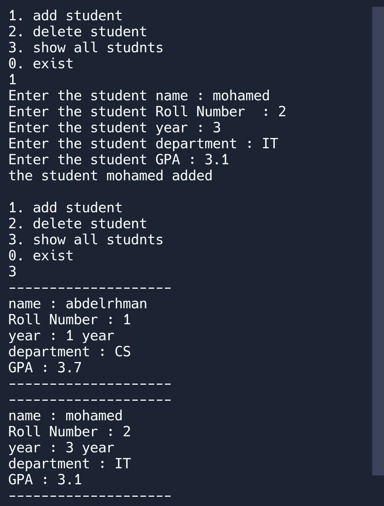

# Student Records Management System

This is a basic C++ console application for managing student records. It allows users to:

- Add a new student with details like name, roll number, year, department, and GPA.
- Display all saved students by reading from a CSV file.
- Delete a student record using the roll number, and update the CSV file accordingly.

## Features

- Uses `vector` and `struct` to manage student data in memory.
- Stores and retrieves student data from a `data.csv` file.
- Validates user input to avoid invalid entries.
- Simple and beginner-friendly code structure.

## How to Use

1. Run the program.
2. Choose an option from the menu:
   - `1`: Add a student.
   - `2`: Delete a student.
   - `3`: Show all students.
   - `0`: Exit the program.
3. The data is automatically saved in `data.csv`.

## Requirements

- C++ compiler (like `g++`, `clang++`)
- Basic understanding of file handling and vectors in C++

### Demo

Here’s a screenshot of the program running in the terminal:

